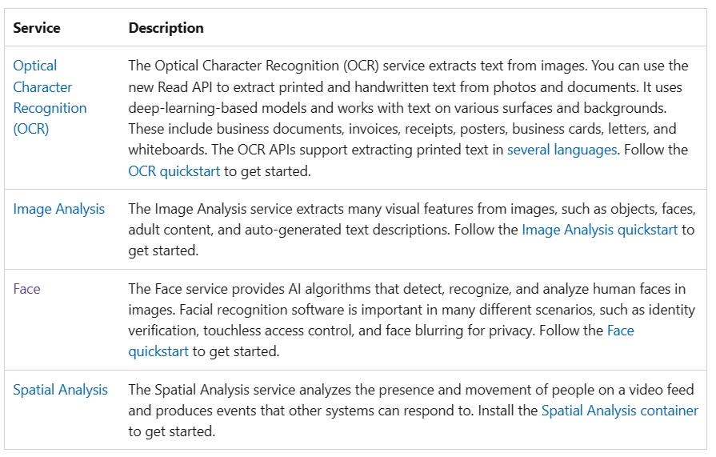
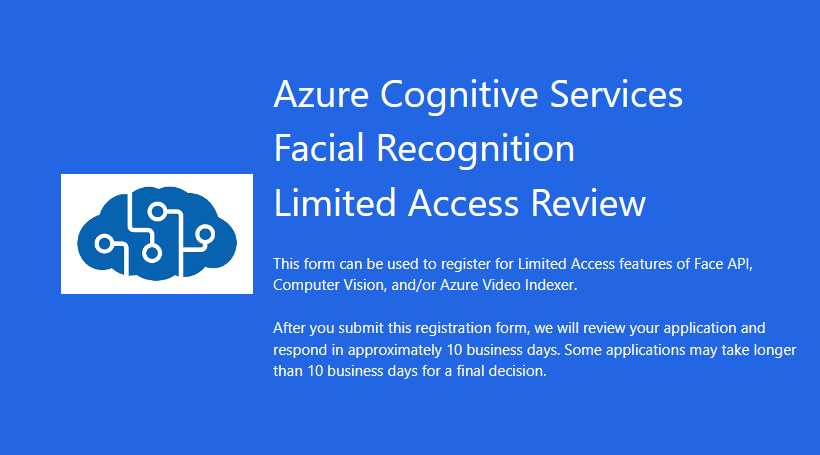

Cognitive Services vs Azure AI
----------

As of July 2023, Azure AI services encompass all of what were previously known as Cognitive Services and Azure Applied AI Services. There are no changes to pricing 
-The names Cognitive Services and Azure Applied AI continue to be used in Azure billing, cost analysis, price list, and price APIs. 
-Computer vision is one of the core areas of artificial intelligence (AI), and focuses on creating solutions that enable AI applications to "see" the world and make sense of it.

Azure AI 
----------
AI is the creation of software that imitates human behaviors and capabilities. Key workloads include:

**Machine learning** - This is often the foundation for an AI system, and is the way we "teach" a computer model to make predictions and draw conclusions from data.

**Anomaly detection** - The capability to automatically detect errors or unusual activity in a system.

**Computer vision** - The capability of software to interpret the world visually through cameras, video, and images.

**Natural language processing** - The capability for a computer to interpret written or spoken language, and respond in kind.

**Knowledge mining** - The capability to extract information from large volumes of often unstructured data to create a searchable knowledge store.

Azure AI is composed of:

Search

**Azure Cognitive Search**

Vision

**Azure AI Vision**. Identify and analyze content within images and videos.

**Azure AI Custom Vision**. Customize image recognition to fit your business needs.

Speech

**Speech to text**. Transcribe audible speech into readable, searchable text.

**Text to speech**. Convert text to lifelike speech for more natural interfaces.

**Speech translation**. Integrate real-time speech translation into your apps.

**Speaker recognition**. Identify and verify the people speaking based on audio.

Language

**Entity recognition**. Identify commonly used and domain-specific terms, including PII extraction.

**Sentiment analysis**. Automatically detect sentiments and opinions from social media, customer reviews and more.

**Conversational language understanding**. Enable your apps to interact with users through natural language.

**Summarization**. Generate summaries of documents and conversation transcripts.
Text analytics for health. Process unstructured medical data to improve patient care.

**Question answering**. Use AI to distill information into easy-to-navigate questions and answers. Supported across more than 100 languages.

Translator

**Text translation**. Translate source text into multiple target languages in real time.

**Document translation**. Translate complex documents while preserving the structures and formats from the original documents.

**Custom translator**. Build customized models to translate domain-specific content and terminology in your style.

**Document Intelligence** turns documents into usable data at a fraction of the time and cost.

Bot

**Bot Service** creates bots and connect them across channels

Audio and Video 
**Video Indexer** analyzes audio and video files

Decision

**Azure AI Anomaly Detector**. Identify potential problems early on.

**Azure AI Content Safety and Azure Content Moderator**. Detect potentially offensive or unwanted content.

**Azure AI Personalizer**. Give customers relevant experiences that improve over time based on their behavior. Improve click-through on home pages, create personalized channels, or optimize coupon offers and terms.

Metric Advisor
**Azure AI Metrics Advisor** proactvely monitor metrics and diagnose issues with 

Immersive Reader

**Azure AI Immersive Reader** Embed text reading and comprehension capabilities 

Responsible AI
-------------------------
At Microsoft, AI software development is guided by a set of six principles, designed to ensure that AI applications provide amazing solutions to difficult problems without any unintended negative consequences.

Fairness
AI systems should treat all people fairly. For example, suppose you create a machine learning model to support a loan approval application for a bank. The model should predict whether the loan should be approved or denied without bias. This bias could be based on gender, ethnicity, or other factors that result in an unfair advantage or disadvantage to specific groups of applicants.

Azure Machine Learning includes the capability to interpret models and quantify the extent to which each feature of the data influences the model's prediction. This capability helps data scientists and developers identify and mitigate bias in the model.

Reliability and safety
AI systems should perform reliably and safely. For example, consider an AI-based software system for an autonomous vehicle; or a machine learning model that diagnoses patient symptoms and recommends prescriptions. Unreliability in these kinds of systems can result in substantial risk to human life.

AI-based software application development must be subjected to rigorous testing and deployment management processes to ensure that they work as expected before release.

Privacy and security
AI systems should be secure and respect privacy. The machine learning models on which AI systems are based rely on large volumes of data, which may contain personal details that must be kept private. Even after the models are trained and the system is in production, privacy and security need to be considered. As the system uses new data to make predictions or take action, both the data and decisions made from the data may be subject to privacy or security concerns.

Inclusiveness
AI systems should empower everyone and engage people. AI should bring benefits to all parts of society, regardless of physical ability, gender, sexual orientation, ethnicity, or other factors.

Transparency
AI systems should be understandable. Users should be made fully aware of the purpose of the system, how it works, and what limitations may be expected.

Accountability
People should be accountable for AI systems. Designers and developers of AI-based solutions should work within a framework of governance and organizational principles that ensure the solution meets ethical and legal standards that are clearly defined.

Machine learning
------------------------

Machine learning is a technique that uses mathematics and statistics to create a model that can predict unknown values.

The supervised machine learning approach requires you to start with a dataset with known label values. Two types of supervised machine learning tasks include regression and classification.

Regression: used to predict a continuous value; like a price, a sales total, or some other measure.
Classification: used to determine a class label; an example of a binary class label is whether a patient has diabetes or not; an example of multi-class labels is classifying text as positive, negative, or neutral.
The unsupervised machine learning approach starts with a dataset without known label values. One type of unsupervised machine learning task is clustering.

Clustering: used to determine labels by grouping similar information into label groups; like grouping measurements from birds into species.

AutoML process
---------------------------
Azure Machine Learning includes an automated machine learning capability that automatically tries multiple pre-processing techniques and model-training algorithms in parallel. These automated capabilities use the power of cloud compute to find the best performing supervised machine learning model for your data.

Automated machine learning allows you to train models without extensive data science or programming knowledge. For people with a data science and programming background, it provides a way to save time and resources by automating algorithm selection and hyperparameter tuning.

You can think of the steps in a machine learning process as:

Prepare data: Identify the features and label in a dataset. Pre-process, or clean and transform, the data as needed.
Train model: Split the data into two groups, a training and a validation set. Train a machine learning model using the training data set. Test the machine learning model for performance using the validation data set.
Evaluate performance: Compare how close the model's predictions are to the known labels.
Deploy a predictive service: After you train a machine learning model, you can deploy the model as an application on a server or device so that others can use it.
These are the same steps in the automated machine learning process with Azure Machine Learning.

The automated machine learning capability in Azure Machine Learning supports supervised machine learning models - in other words, models for which the training data includes known label values. You can use automated machine learning to train models for:

Classification (predicting categories or classes)
Regression (predicting numeric values)
Time series forecasting (predicting numeric values at a future point in time)

In Azure Machine Learning studio, you can manage the compute targets for your data science activities. There are four kinds of compute resource you can create:

Compute Instances: Development workstations that data scientists can use to work with data and models.
Compute Clusters: Scalable clusters of virtual machines for on-demand processing of experiment code.
Kubernetes Clusters: Deployment targets for predictive services that use your trained models. You can access previous versions of "inference clusters" here.
Attached Compute: Links to existing Azure compute resources, such as Virtual Machines or Azure Databricks clusters.

Evaluate Model 
Mean Absolute Error (MAE): The average difference between predicted values and true values. This value is based on the same units as the label, in this case dollars. The lower this value is, the better the model is predicting.
Root Mean Squared Error (RMSE): The square root of the mean squared difference between predicted and true values. The result is a metric based on the same unit as the label (dollars). When compared to the MAE (above), a larger difference indicates greater variance in the individual errors (for example, with some errors being very small, while others are large).
Relative Squared Error (RSE): A relative metric between 0 and 1 based on the square of the differences between predicted and true values. The closer to 0 this metric is, the better the model is performing. Because this metric is relative, it can be used to compare models where the labels are in different units.
Relative Absolute Error (RAE): A relative metric between 0 and 1 based on the absolute differences between predicted and true values. The closer to 0 this metric is, the better the model is performing. Like RSE, this metric can be used to compare models where the labels are in different units.
Coefficient of Determination (R2): This metric is more commonly referred to as R-Squared, and summarizes how much of the variance between predicted and true values is explained by the model. The closer to 1 this value is, the better the model is performing.

You have the ability to deploy a service that can be used in real-time. In order to automate your model into a service that makes continuous predictions, you need to create and deploy an inference pipeline.

Inference pipeline
To deploy your pipeline, you must first convert the training pipeline into a real-time inference pipeline. This process removes training components and adds web service inputs and outputs to handle requests.

The inference pipeline performs the same data transformations as the first pipeline for new data. Then it uses the trained model to infer, or predict, label values based on its features. This model will form the basis for a predictive service that you can publish for applications to use.

Clustering 
---------------

Clustering is a form of machine learning that is used to group similar items into clusters based on their features. For example, a researcher might take measurements of penguins, and group them based on similarities in their proportions.

In contrast to supervised machine learning, unsupervised learning is used when there is no "ground truth" from which to train and validate label predictions. The most common form of unsupervised learning is clustering, which is similar conceptually to classification, except that the the training data does not include known values for the class label to be predicted. Clustering works by separating the training cases based on similarities that can be determined from their feature values. The numeric features of a given entity can be thought of as vector coordinates that define the entity's position in n-dimensional space. What a clustering model seeks to do is to identify groups, or clusters, of entities that are close to one another while being separated from other clusters.

The K-Means Clustering algorithm groups items into the number of clusters, or centroids, you specify - a value referred to as K.

The K-Means algorithm works by:

Initializing K coordinates as randomly selected points called centroids in n-dimensional space (where n is the number of dimensions in the feature vectors).
Plotting the feature vectors as points in the same space, and assigning each point to its closest centroid.
Moving the centroids to the middle of the points allocated to it (based on the mean distance).
Reassigning the points to their closest centroid after the move.
Repeating steps 3 and 4 until the cluster allocations stabilize or the specified number of iterations has completed.

https://microsoftlearning.github.io/AI-900-AIFundamentals/instructions/02c-create-clustering-model.html

Note: You can think of data observations, like the penguin measurements, as being multidimensional vectors. 

Knowledge mining in Microsoft Azure
------------------------------
One of these knowledge mining solutions is Azure Cognitive Search, a private, enterprise, search solution that has tools for building indexes. The indexes can then be used for internal only use, or to enable searchable content on public facing internet assets.

Azure Cognitive Search can utilize the built-in AI capabilities of Azure AI services such as image processing, content extraction, and natural language processing to perform knowledge mining of documents. The product's AI capabilities makes it possible to index previously unsearchable documents and to extract and surface insights from large amounts of data quickly.

Computer Vision
---------------------------------
Some potential uses for computer vision include:

**Content Organization**: Identify people or objects in photos and organize them based on that identification. Photo recognition applications like this are commonly used in photo storage and social media applications.

**Text Extraction**: Analyze images and PDF documents that contain text and extract the text into a structured format.

**Spatial Analysis**: Identify people or objects, such as cars, in a space and map their movement within that space.
To an AI application, an image is just an array of pixel values. These numeric values can be used as features to train machine learning models that make predictions about the image and its contents.

Microsoft's Azure AI Vision service provides pre-built computer vision capabilities. The service can analyze images, and return detailed information about an image and the objects it depicts.

To use Azure AI Vision, you need to create a resource for it in your Azure subscription. You can use either of the following resource types:

**Computer Vision**: A specific resource for the Computer Vision service. Use this resource type if you don't intend to use any other Azure AI Services, or if you want to track utilization and costs for your Computer Vision resource separately.
**Azure AI services**: A general resource that includes Computer Vision along with many other Azure AI services; such as Azure AI Language, Azure AI Custom Vision, Azure AI Translator, and others. Use this resource type if you plan to use multiple AI services and want to simplify administration and development.

**Tagging visual features**
The image descriptions generated by Azure AI Vision are based on a set of thousands of recognizable objects, which can be used to suggest tags for the image. These tags can be associated with the image as metadata that summarizes attributes of the image; and can be particularly useful if you want to index an image along with a set of key terms that might be used to search for images with specific attributes or contents.

**Detecting objects**
The object detection capability is similar to tagging, in that the service can identify common objects; but rather than tagging, or providing tags for the recognized objects only, this service can also return what is known as bounding box coordinates. Not only will you get the type of object, but you will also receive a set of coordinates that indicate the top, left, width, and height of the object detected, which you can use to identify the location of the object in the image.

**Detecting brands**
This feature provides the ability to identify commercial brands. Azure AI Vision has an existing database of thousands of globally recognized logos from commercial brands of products.

**Detecting faces**
Azure AI Vision can detect and analyze human faces in an image, including the ability to determine age and a bounding box rectangle for the location of the face(s). The facial analysis capabilities of Azure AI Vision service are a subset of those provided by the dedicated Azure AI Face service.

**Categorizing an image**
Azure AI Vision can categorize images based on their contents. The service uses a parent/child hierarchy with a "current" limited set of categories. When analyzing an image, detected objects are compared to the existing categories to determine the best way to provide the categorization. As an example, one of the parent categories is people_. This image of a person on a roof is assigned a category of people_.

Detecting domain-specific content -
When categorizing an image, the Azure AI Vision service supports two specialized domain models:

**Celebrities** - The service includes a model that has been trained to identify thousands of well-known celebrities from the worlds of sports, entertainment, and business.
**Landmarks** - The service can identify famous landmarks, such as the Taj Mahal and the Statue of Liberty.

**Optical character recognition**
Azure AI Vision service can use optical character recognition (OCR) capabilities to detect printed and handwritten text in images. 

In addition to these capabilities, the Azure AI Vision service can:

**Detect image types** - for example, identifying clip art images or line drawings.
Detect image color schemes - specifically, identifying the dominant foreground, background, and overall colors in an image.
Generate thumbnails - creating small versions of images.
Moderate content - detecting images that contain adult content or depict violent, gory scenes.

https://microsoftlearning.github.io/AI-900-AIFundamentals/instructions/03-module-03.html

Azure's Azure AI Vision service gives you access to advanced algorithms that process images and return information based on the visual features you're interested in.

https://portal.vision.cognitive.azure.com/gallery/featured

Image classification is a common workload in artificial intelligence (AI) applications. It harnesses the predictive power of machine learning to enable AI systems to identify real-world items based on images.

Most modern image classification solutions are based on **deep learning** techniques that make use of convolutional neural networks (CNNs) to uncover patterns in the pixels that correspond to particular classes. Training an effective CNN is a complex task that requires considerable expertise in data science and machine learning.

Common techniques used to train image classification models have been encapsulated into the Azure AI Custom Vision service in Microsoft Azure; making it easy to train a model and publish it as a software service with minimal knowledge of deep learning techniques. You can use the Azure AI Custom Vision to train image classification models and deploy them as services for applications to use.

**Face detection** and analysis is an area of artificial intelligence (AI) in which we use algorithms to locate and analyze human faces in images or video content.

**Facial analysis**
Moving beyond simple face detection, some algorithms can also return other information, such as facial landmarks (nose, eyes, eyebrows, lips, and others).
These facial landmarks can be used as features with which to train a machine learning model.

A further application of facial analysis is to train a machine learning model to identify known individuals from their facial features. This usage is more generally known as **Facial recognition**, and involves using multiple images of each person you want to recognize to train a model so that it can detect those individuals in new images on which it wasn't trained.

Microsoft Azure provides multiple Azure AI services that you can use to detect and analyze faces, including:

Azure AI Computer Vision, which offers face detection and some basic face analysis, such as returning the bounding box coordinates around an image.
Azure AI Video Indexer, which you can use to detect and identify faces in a video.
Azure AI Face, which offers pre-built algorithms that can detect, recognize, and analyze faces.

Effective today, new customers need to apply for access to use facial recognition operations in Azure Face API, Computer Vision, and Video Indexer. Existing customers have one year to apply and receive approval for continued access to the facial recognition services based on their provided use cases. By introducing Limited Access, we add an additional layer of scrutiny to the use and deployment of facial recognition to ensure use of these services aligns with Microsoft’s Responsible AI Standard and contributes to high-value end-user and societal benefit. This includes introducing use case and customer eligibility requirements to gain access to these services. Read about example use cases, and use cases to avoid, here. Starting June 30, 2023, existing customers will no longer be able to access facial recognition capabilities if their facial recognition application has not been approved. Submit an application form for facial and celebrity recognition operations in Face API, Computer Vision, and Azure Video Indexer here, and our team will be in touch via email.
https://aka.ms/facerecognition

**Optical character recognition (OCR)** enables artificial intelligence (AI) systems to read text in images, enabling applications to extract information from photographs, scanned documents, and other sources of digitized text, where computer vision intersects with natural language processing. You need computer vision capabilities to "read" the text, and then you need natural language processing capabilities to make sense of it.
The **Read API** can handle scanned documents that have a lot of text. It also has the ability to automatically determine the proper recognition model to use, taking into consideration lines of text and supporting images with printed text as well as recognizing handwriting.
**Azure AI Document Intelligence** service can solve for this issue by digitizing fields from documents using optical character recognition (OCR). 
Azure AI Document Intelligence supports automated document processing through:
**Prebuilt models** that are trained to recognize and extract data for common scenarios such as IDs, receipts, and invoices.
**Custom models**, which enable you to extract what are known as key/value pairs and table data from forms. Custom models are trained using your own data, which helps to tailor this model to your specific forms. Starting with a few samples of your forms, you can train the custom model. After the first training exercise, you can evaluate the results and consider if you need to add more samples and re-train.

**Azure AI Custom Vision** available as part of the Azure AI Services offerings. This is generally easier and quicker than writing your own model training code, and enables people with little or no machine learning expertise to create an effective image classification solution.

Azure AI Language
------------------

**Azure AI Language** service can help simplify application development by using pre-trained models that can:

Determine the language of a document or text (for example, French or English).
Perform sentiment analysis on text to determine a positive or negative sentiment.
Extract key phrases from text that might indicate its main talking points.
Identify and categorize entities in the text. Entities can be people, places, organizations, or even everyday items such as dates, times, quantities, and so on.

Statistical analysis of terms used in the text. For example, removing common **"stop words"** (words like "the" or "a", which reveal little semantic information about the text), and performing frequency analysis of the remaining words (counting how often each word appears) can provide clues about the main subject of the text.
Extending frequency analysis to multi-term phrases, commonly known as **N-grams** (a two-word phrase is a bi-gram, a three-word phrase is a tri-gram, and so on).
Applying **stemming or lemmatization** algorithms to normalize words before counting them - for example, so that words like "power", "powered", and "powerful" are interpreted as being the same word.
Applying linguistic structure rules to analyze sentences - for example, breaking down sentences into tree-like structures such as a **noun phrase**, which itself contains nouns, verbs, adjectives, and so on.
Encoding words or terms as numeric features that can be used to train a machine learning model. For example, to classify a text document based on the terms it contains. This technique is often used to perform **sentiment analysis**, in which a document is classified as positive or negative.
Creating **vectorized models** that capture semantic relationships between words by assigning them to locations in n-dimensional space. This modeling technique might, for example, assign values to the words "flower" and "plant" that locate them close to one another, while "skateboard" might be given a value that positions it much further away.

Azure AI Language to analyze the text ":-)", results in a value of unknown for the language name and the language identifier, and a score of NaN (which is used to indicate not a number).

Language detection capability of Azure AI Language to identify the language in which text is written.

Azure AI Language uses a prebuilt machine learning classification model to evaluate the text. The service returns a sentiment score in the range of 0 to 1. Values closer to 1 represent a positive sentiment. Scores that are close to the middle of the range (0.5) are considered neutral or indeterminate.

Key phrase extraction is the concept of evaluating the text of a document, or documents, and then identifying the main talking points of the document(s). 

**Entity recognition** provides Azure AI Language with unstructured text and it will return a list of entities in the text that it recognizes.
**Named Entity Recognition (NER)** is one of the features offered by Azure AI Language, a collection of machine learning and AI algorithms in the cloud for developing intelligent applications that involve written language. The NER feature can identify and categorize entities in unstructured text. For example: people, places, organizations, and quantities.

Entity linking identifies and disambiguates the identity of entities found in text. For example, in the sentence "We went to Seattle last week.", the word "Seattle" would be identified, with a link to more information on Wikipedia.

**Document processing models**

Azure AI Document Intelligence supports a wide variety of models that enable you to add intelligent document processing to your apps and flows. You can use a prebuilt document analysis or domain specific model or train a custom model tailored to your specific business needs and use cases.
Prebuilt models	
Health insurance card	Automate healthcare processes by extracting insurer, member, prescription, group number and other key information from US health insurance cards.
US Tax document models	Process US tax forms to extract employee, employer, wage, and other information.
Contract	Extract agreement and party details.
Invoice	Automate invoices.
Receipt	Extract receipt data from receipts.
Identity document (ID)	Extract identity (ID) fields from US driver licenses and international passports.
Business card	Scan business cards to extract key fields and data into your applications.
Custom model
Custom model (overview)	Extract data from forms and documents specific to your business. Custom models are trained for your distinct data and use cases.
Custom extraction models	● Custom template models use layout cues to extract values from documents and are suitable to extract fields from highly structured documents with defined visual templates.
Custom neural models are trained on various document types to extract fields from structured, semi-structured and unstructured documents.
Custom classification model	The Custom classification model can classify each page in an input file to identify the document(s) within and can also identify multiple documents or multiple instances of a single document within an input file.
Composed models	Combine several custom models into a single model to automate processing of diverse document types with a single composed model.

AI system must support two capabilities:

Speech recognition - the ability to detect and interpret spoken input.
Speech synthesis - the ability to generate spoken output.

 **Azure AI Speech** service, which includes the following application programming interfaces (APIs):

- The Speech to text API
- The Text to speech API

Speech recognition is concerned with taking the spoken word and converting it into data that can be processed - often by transcribing it into a text representation. The spoken words can be in the form of a recorded voice in an audio file, or live audio from a microphone. Speech patterns are analyzed in the audio to determine recognizable patterns that are mapped to words. To accomplish this feat, the software typically uses multiple types of models, including:

An acoustic model that converts the audio signal into phonemes (representations of specific sounds).
A language model that maps phonemes to words, usually using a statistical algorithm that predicts the most probable sequence of words based on the phonemes.

Speech synthesis is in many respects the reverse of speech recognition. It is concerned with vocalizing data, usually by converting text to speech. A speech synthesis solution typically requires the following information:

The text to be spoken.
The voice to be used to vocalize the speech.
To synthesize speech, the system typically tokenizes the text to break it down into individual words, and assigns phonetic sounds to each word. It then breaks the phonetic transcription into prosodic units (such as phrases, clauses, or sentences) to create phonemes that will be converted to audio format. These phonemes are then synthesized as audio by applying a voice, which will determine parameters such as pitch and timbre; and generating an audio wave form that can be output to a speaker or written to a file.

The service includes multiple pre-defined voices with support for multiple languages and regional pronunciation, including standard voices as well as neural voices that leverage neural networks to overcome common limitations in speech synthesis with regard to intonation, resulting in a more natural sounding voice. You can also develop custom voices and use them with the text to speech API

Text translation can be used to translate documents from one language to another, translate email communications that come from foreign governments, and even provide the ability to translate web pages on the Internet. Many times you will see a Translate option for posts on social media sites, or the Bing search engine can offer to translate entire web pages that are returned in search results.
**Azure AI Translator** uses a **Neural Machine Translation (NMT)** model for translation, which analyzes the semantic context of the text and renders a more accurate and complete translation as a result.
Microsoft AI Translator released Neural Machine Translation (NMT) in 2016. NMT provided major advances in translation quality over the industry-standard Statistical Machine Translation (SMT) technology. Because NMT better captures the context of full sentences before translating them, it provides higher quality, more human-sounding, and more fluent translations. 
**Custom Translator** is a feature of the Microsoft Translator service, which enables enterprises, app developers, and language service providers to build customized neural machine translation (NMT) systems. 
Azure AI Translator supports text-to-text translation between more than 60 languages. When using the service, you must specify the language you are translating from and the language you are translating to using ISO 639-1 language codes, such as en for English, fr for French, and zh for Chinese. Alternatively, you can specify cultural variants of languages by extending the language code with the appropriate 3166-1 cultural code - for example, en-US for US English, en-GB for British English, or fr-CA for Canadian French.

Speech translation is used to translate between spoken languages, sometimes directly (speech-to-speech translation) and sometimes by translating to an intermediary text format (speech-to-text translation).

**Azure AI Language** service works with conversational language understanding, you need to take into account three core concepts: utterances, entities, and intents (ie. Turing test).

**Utterance** is an example of something a user might say, and which your application must interpret. For example, when using a home automation system, a user might use the following utterances:

"Switch the fan on."

"Turn on the light."

**Entity** is an item to which an utterance refers. For example, fan and light in the following utterances:

"Switch the fan on."

"Turn on the light."

**Intent** represents the purpose, or goal, expressed in a user's utterance. For example, for both of the previously considered utterances, the intent is to turn a device on; so in your conversational language understanding application, you might define a TurnOn intent that is related to these utterances.

 Of special interest is the None intent. You should consider always using the None intent to help handle utterances that do not map any of the utterances you have entered. The None intent is considered a fallback, and is typically used to provide a generic response to users when their requests don't match any other intent.

 Creating an application with conversational language understanding consists of two main tasks. First you must define entities, intents, and utterances with which to train the language model - referred to as **authoring the model**. Then you must publish the model so that client applications can use it for intent and entity prediction based on user input.

 Conversational language understanding provides a comprehensive collection of **prebuilt domains** that include pre-defined intents and entities for common scenarios; which you can use as a starting point for your model. You can also create your own entities and intents.

 Define intents based on actions a user would want to perform with your application. For each intent, you should include a variety of utterances that provide examples of how a user might express the intent.

 There are four types of entities:

Machine-Learned: Entities that are learned by your model during training from context in the sample utterances you provide.
List: Entities that are defined as a hierarchy of lists and sublists. For example, a device list might include sublists for light and fan. For each list entry, you can specify synonyms, such as lamp for light.
RegEx: Entities that are defined as a regular expression that describes a pattern - for example, you might define a pattern like [0-9]{3}-[0-9]{3}-[0-9]{4} for telephone numbers of the form 555-123-4567.
Pattern.any: Entities that are used with patterns to define complex entities that may be hard to extract from sample utterances.

After you have defined the intents and entities in your model, and included a suitable set of sample utterances; the next step is to train the model. Training is the process of using your sample utterances to teach your model to match natural language expressions that a user might say to probable intents and entities.

Azure Bot
---------------------------------------------------------------
Bot solution solution requires:

A knowledge base of question and answer pairs - usually with some built-in natural language processing model to enable questions that can be phrased in multiple ways to be understood with the same semantic meaning.
A bot service that provides an interface to the knowledge base through one or more channels.

You can easily create a user support bot solution on Microsoft Azure using a combination of two core services:

**Azure AI Language** includes a custom question answering feature that enables you to create a knowledge base of question and answer pairs that can be queried using natural language input.

The question answering capability in Azure AI Language is a newer version of the QnA Maker service - which is still available as a separate service.

**Azure AI Bot Service** provides a framework for developing, publishing, and managing bots on Azure.

Azure AI Content Safety 
-----------
Azure AI Content Safety is a comprehensive solution designed to detect harmful user-generated and AI-generated content in applications and services. Azure AI Content Safety is suitable for many scenarios such as online marketplaces, gaming companies, social messaging platforms, enterprise media companies, and K-12 education solution providers. Here's an overview of its features and capabilities:

**Text and Image Detection APIs**: Scan text and images for sexual content, violence, hate, and self-harm with multiple severity levels.

**Content Safety Studio**: An online tool designed to handle potentially offensive, risky, or undesirable content using our latest content moderation ML models. It provides templates and customized workflows that enable users to build their own content moderation systems.

**Language support**: Azure AI Content Safety supports more than 100 languages and is specifically trained on English, German, Japanese, Spanish, French, Italian, Portuguese, and Chinese.
